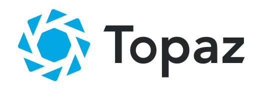

<p align="center">
  <a href="https://topaz.io">
    
  </a>
</p>
<h3 align="center">
  💎 ⛓️ 🔒
</h3>
<h3 align="center">
  Placing trust in technology
</h3>
<h3 align="center">
  <a href="https://topaz.io/docs/">Documentation</a>
  <span> · </span>
  <a href="https://topaz.io/tutorial/">Tutorial</a>
  <span> · </span>
  <a href="https://join.slack.com/t/topaz-developers/shared_invite/zt-7bxno80m-nGrysu2fid_vh0iFFr5hUg">Community Slack</a>
</h3>
<p align="center">
  Topaz is an open source Layer 2 solution that helps developers secure data
  from any application using Ethereum.
</p>
<p align="center">
  <a href="https://github.com/decent-labs/topaz/blob/master/LICENSE">
    
  </a>
  <a href="https://circleci.com/gh/decent-labs/topaz">
    
  </a>
  <a href="https://www.npmjs.org/package/topaz">
    
  </a>
  <a href="https://npmcharts.com/compare/topaz?minimal=true">
    
  </a>
  <a href="https://npmcharts.com/compare/topaz?minimal=true">
    
  </a>
  <a href="https://topaz.io/tutorial">
    
  </a>
  <a href="https://twitter.com/intent/follow?screen_name=topaztellstruth">
    
  </a>
</p>

- **Simplify Blockchain Software Development.** Integrate any existing
  application with Ethereum, enabling blockchain use cases without smart
  contract development or prior experience in blockchain development.

- **Bypass Transaction Constraints.** Topaz batches transactions into secure
  data structures, anchoring many transactions on chain at once avoiding the
  scaling constraints of transaction throughput.

- **Outscale Any Blockchain.** Our hybrid development pattern using data from
  centralized applications secured on decentralized networks enables the usage
  of blockchains for data integrity at the massive scale the web demands.

- **Trial with Ease.** Our SDKs enable Topaz integration with just three lines
  of code - now, anyone can experiment with using blockchains to create
  transparent, trustless applications with ease.

- **Go to Mainnet for Pennies.** Topaz enables applications that simply could
  not exist due to scaling constraints brought on by the cost of Ethereum
  transactions.

<p align="center">
  <a href="https://topaz.io/tutorial">
    <b>Learn how to use Topaz for your next dApp project.</b>
  </a>
</p>

## What’s In This Document

- [Getting Started](#getting-started)
- [Learning Topaz](#learning-topaz)
- [Code of Conduct](#code-of-conduct)
- [How to Contribute](#how-to-contribute)
- [License](#license)
- [Thanks](#thanks)

## Getting Started

You'll need [`go`](https://golang.org/) installed.

You can get Topaz running on your local dev environment in a few minutes with
these four steps:

1. **Configure your dev environment.**

    This project uses golang modules, so simple building or running the
    project(s) will download and install the correct version of dependencies,
    based on `go.mod` and `go.sum`.

    Configure your environment:

    ```shell
    cp .env.example .env
    ```

2. **Start the Docker containers.**

    Next, spin up your containers:

    ```shell
    docker-compose up -d
    ```

3. **Start the API.**

    Launch the API with `make`.

    ```shell
    cd api
    make run
    ```

4. **Start the Batch process.**

    In a new terminal window,

    ```shell
    cd batch
    make run
    ```

At this point, you've got a fully functional Topaz running on your machine. For
instructions on how to use Topaz and our API, see our
[documentation](https://topaz.io/docs) and
[tutorial](https://topaz.io/tutorial).

## Learning Topaz

Full documentation for the Topaz API lives on our
[docsite](https://topaz.io/docs).

**For most developers, we recommend starting with our [in-depth tutorial on
integrating an app with Topaz](https://topaz.io/tutorial).** It walks through
every step of the process.

## Code of Conduct

We strive to create a healthy, inclusive, and safe environment for all people
and follow the [Contributor Covenant](https://contributor-covenant.org). Please
take a look at our [Code of Conduct](./CODE_OF_CONDUCT.md) for more
information.

## How to Contribute

Regardless of how you seek to contribute, we'd love to have you as part of the
Topaz developer community!

Check out our [Developer Community Slack](https://join.slack.com/t/topaz-developers/shared_invite/zt-7bxno80m-nGrysu2fid_vh0iFFr5hUg)
for more information about contributing to Topaz.

## License

Licensed under the [MIT License](./LICENSE).

## Thanks

Thanks to everyone who has made a contribution, no matter how big or small!
